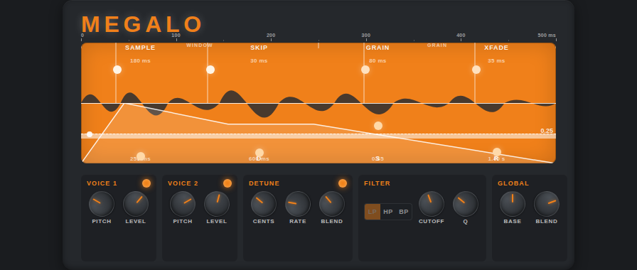

# Megalo



Megalo is a **granular freeze / sustain** effect for guitar (and other mono
sources), with two pitch-shifter voices, a detune/chorus, a filter (LP/HP/BP)
and an ADSR envelope.

Mono output, or decorrelated stereo output.

- **LV2** — Linux desktop, MOD Audio, Raspberry Pi
- **VST3 / AU / Standalone** — macOS (universal) and Windows, via JUCE

---

## Build LV2 (Linux desktop)

Requires `pkg-config` and the LV2 headers (`lv2-dev`).

```sh
make                       # produces megalo.lv2/megalo.so
sudo make install          # installs to /usr/lib/lv2/megalo.lv2
```

---

## Build for MOD with mod-plugin-builder

With a [mod-plugin-builder](https://github.com/mod-audio/mod-plugin-builder)
environment in place:

Copy the provided `.mk` file from `plugins/package/megalo/` to
`mod-plugin-builder/plugins/package/megalo`.

```sh
# From the mod-plugin-builder root
./build <platform> megalo

# Examples:
./build moddwarf-new megalo          # MOD Dwarf (tuned for Cortex-A35)
./build modduox-new  megalo          # Raspberry Pi 5 / Duo X compatible (tuned for Cortex-A76)
```

On the Pi 5 / Cortex-A76 the `.mk` automatically enables the phase-vocoder
pitch shifter (`-DMEGALO_PHASE_VOCODER`); on the MOD Dwarf it uses the granular
engine.

---

## Build VST3 / AU / Standalone (macOS and Windows)

JUCE project in `juce/`. JUCE is downloaded automatically (FetchContent).

```sh
cmake -B juce/build -S juce -DCMAKE_BUILD_TYPE=Release
cmake --build juce/build --config Release --parallel
```

The binaries land in `juce/build/Megalo_artefacts/Release/`
(`AU/`, `VST3/`, `Standalone/`).

### macOS

The build is **universal** (arm64 + x86_64) by default. With
`COPY_AFTER_BUILD=ON` (the default), the plugins are also copied into your user
folders (`~/Library/Audio/Plug-Ins/...`).

```sh
cmake -B juce/build -S juce -DCMAKE_BUILD_TYPE=Release \
      -DCMAKE_OSX_ARCHITECTURES="arm64;x86_64"
cmake --build juce/build --config Release --parallel
```

### Windows

Same command, VST3 + Standalone (`.exe`):

```sh
cmake -B juce/build -S juce -DCMAKE_BUILD_TYPE=Release
cmake --build juce/build --config Release --parallel
```

## License

GPL-3.0-or-later.
</content>
